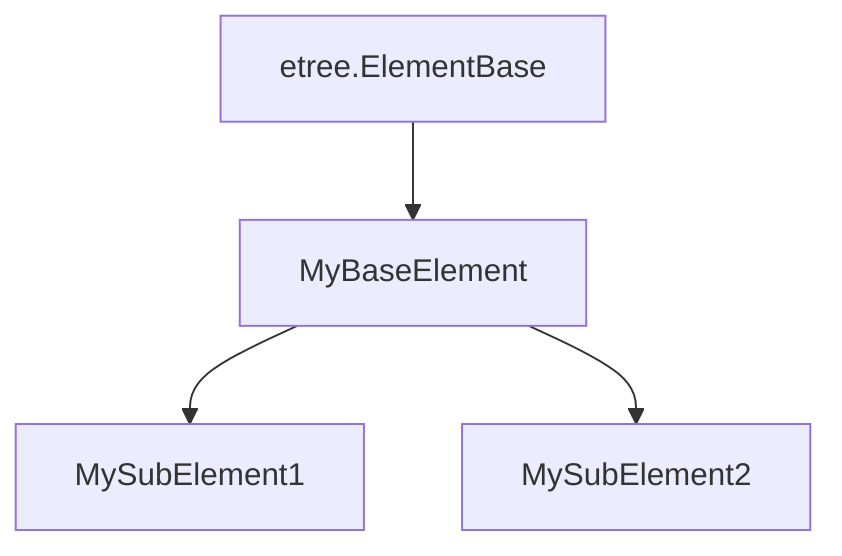

## Important note

- Next release after `2024.04.14` contains multiple build; please check out [Installation section](#installation) on choosing the desired build (hint: many people don't need to bother with this)
- `2024.04.14` release requires `mypy 1.9`; `2024.03.27` is the last release supporting `mypy 1.5`.
- `2024.03.27` release requires [cssselect package](https://pypi.org/project/cssselect/) to work, since `lxml.cssselect` submodule utilises inline annotation from `cssselect 1.2.0`.

## Introduction

This repository contains [external type annotations](https://peps.python.org/pep-0561/) for [`lxml`](http://lxml.de/). It can be used by type-checking tools (currently supporting [`mypy`](https://pypi.org/project/mypy/) and [`pyright`](https://github.com/Microsoft/pyright)) to check code that uses `lxml`, or used within IDEs like [VSCode](https://code.visualstudio.com/) or [PyCharm](https://www.jetbrains.com/pycharm/) to facilitate development.

## Goal ① : Completion

Now the coverage of `lxml` submodules is complete (unless intentionally rejected, see further below), thus no more [considered as `partial`](https://peps.python.org/pep-0561/#partial-stub-packages):
  - [x] `lxml.etree`
  - [x] `lxml.html`
    - [x] `lxml.html.builder`
    - [x] `lxml.html.clean` (already removed in lxml 5.2.0, this project will follow suite in future)
    - [x] `lxml.html.diff`
    - [x] `lxml.html.html5parser`
    - [x] `lxml.html.soupparser`
  - [x] `lxml.isoschematron`
  - [x] `lxml.objectify`
  - [x] `lxml.builder`
  - [x] `lxml.cssselect`
  - [x] `lxml.sax`
  - [x] `lxml.ElementInclude`

Following submodules will not be implemented due to irrelevance to type checking or other reasons:

  - `lxml.etree.Schematron` (obsolete and superseded by `lxml.isoschematron`)
  - `lxml.usedoctest`
  - `lxml.html.usedoctest`
  - `lxml.html.formfill` (shouldn't have existed, this would belong to HTTP libraries like `requests` or `httpx`)

Check out [project page](https://github.com/abelcheung/types-lxml/projects) for future plans and progress.

## Goal ② : Support multiple type checkers

Currently the annotations are validated for both `mypy` and `pyright`.

In the future, there is plan to bring even more type checker support.

## Goal ③: Review and test suite

- [x] All prior `lxml-stubs` contributions are reviewed thoroughly, bringing coherency of annotation across the whole package
- [x] Much more extensive test cases
  - [x] Mypy test suite already vastly expanded
  - [x] Perform runtime check, and compare against static type checker result; this guarantees annotations are indeed working in real code, not just in some cooked up test suite
    - [x] Proof of concept for incorporating `pyright` result under progress, currently just comparing `reveal_type()` results
    - [ ] Migrate static `mypy` tests to runtime `pyright` tests in future (under progress)
- [x] Modernize package building infrastructure

## Goal ④ : Support for IDEs

Despite having no official PEP, some IDEs support showing docstring from external annotations. This package tries to bring type annotation specific docstrings for some `lxml` classes and functions, explaining how they can be used. Following screenshots show what would look like in Visual Studio Code, behaving as if docstrings come from real python code:

Besides docstring, current annotations are geared towards convenience for code writers instead of absolute logical 'correctness'. The [deviation of class inheritance](https://github.com/abelcheung/types-lxml/wiki/Element-inheritance-change) for `HtmlComment` and friends is one prominent example.

## Installation

The normal choice for most people is to fetch package from PyPI via `pip`:

    pip install -U types-lxml

In the unlikely case PyPI is down, one can directly download wheel from [latest release in GitHub](https://github.com/abelcheung/types-lxml/releases/latest), and then perform installation as local file:

    pip install -U types-lxml*.whl

Or directly run bleeding edge version from GitHub repository:

    pip install -U git+https://github.com/abelcheung/types-lxml.git

### Choosing the build

Since the version after `2024.04.14` release, there will be two versions of `types-lxml`. First one is the default one; if there's no problem using it, there's no need to switch.

The second version, `types-lxml-multi-subclass`, is intended for specific need, namely creation of multiple lxml element subclasses. For example:

If a parsed or constructed element tree consists of single type of element nodes, it is safe to assume the children or parent of a node are of the same type too. But this assumption does not hold for multiple subclasses. Using diagram above as example, we can only deduce the children and parent type is `MyBaseElement` (or any of its subclasses). The 2 paradigms can't coexist within a single type annotation package. See [bug #51](https://github.com/abelcheung/types-lxml/issues/51) that illustrated why multiple build is necessary.

Remember that anybody can only choose one of the 2 builds. It is impossible to install both, as `pip` just [arbitrarily overwrite conflicting files with one another](https://github.com/pypa/pip/issues/4625). If in doubt, removing existing package first, then install the one you needed.

## History

Type annotations for `lxml` were initially included in [typeshed](https://www.github.com/python/typeshed), but as it was still incomplete at that time, the stubs are [ripped out as a separate project](https://github.com/python/typeshed/issues/525). The code was since then under governance of lxml, until 2022 when this fork intended to revamp `lxml-stubs` completely and emerge into separate project.

`types-lxml` is a fork of `lxml-stubs` that strives for the goals described above, so that most people would find it more useful.
